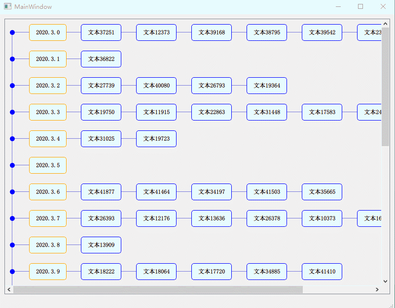

Qt-TimelineWidget
===

## 介绍

Qt 多列时间轴控件。

可与多段字符串格式自由转换，也可手动添加列表项。

专门用来以时间轴作为事件线发展顺序的故事大纲。

## 特点

- 时间可输入任意内容，不限于时间
- 每一时间段允许多列，即多个文字节点
- 全自动调整节点大小（宽高），尽量看起来舒服
- 行与行、列与列 之间任意拖拽更换顺序
- 多行操作
- 可与文字自由转换，默认一段为一个文字节点
- 美观的调整动画

## 待办

- [ ] 多个文字节点竖向对齐
- [ ] 不同时间段之间的故事线可连成一条线

## 截图

